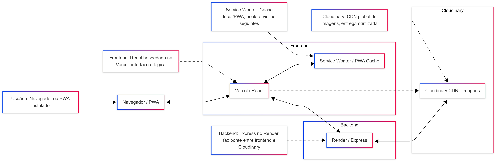

# Portfólio Fotográfico - Vitoria

Site em React + Vite. O deploy atual ainda responde pela Vercel, mas o repositório agora inclui a base para migracao do frontend para GCP com `Cloud Storage + CDN + HTTPS Load Balancer + Cloud Armor`.

As fotos publicadas ficam no repositório em `public/images/galeria/<galeria>/` e o site usa um mapa local em `src/localAssetsLoader.js`.

## Como rodar o projeto

### 1. Instale as dependências

```bash
npm install
```

### 2. Inicie o frontend React

```bash
npm run dev
```
O frontend ficará disponível em http://localhost:5173 (ou porta definida pelo Vite).

### 3. Acesse as galerias

- `/galeria-infantil` → pasta "infantil" no Cloudinary
- `/galeria-casamentos` → pasta "casamentos"
- `/galeria-femininos` → pasta "femininos"
- `/galeria-preweding` → pasta "pre-weding"

> Observacao: as rotas acima exibem as galerias locais do repo. Existe um fallback opcional para API (ver "Modo API (opcional)" abaixo).

## Como subir fotos (recomendado)

## Portal admin com Firebase Auth e GCP

Tambem existe uma tela para abstrair o GitHub da cliente:

- URL: `/admin/galeria`
- Login: Firebase Auth (Email/Senha)
- Saida: Pull Request criado automaticamente no GitHub (a cliente nao precisa usar GitHub)
- Backend: GCP Cloud Run
- URL do backend admin: `https://photo-vitoria-admin-api-rxpgnk6khq-uc.a.run.app`

Guia para a usuaria (sem termos tecnicos):

- `docs/GUIA-PORTAL-ADMIN.md`

Arquitetura e desenho do fluxo:

- `docs/ARQUITETURA.md`
- Segurança: Turnstile validado server-side antes do login

Fluxo interno:

1. A cliente faz login com Firebase Auth.
2. A tela valida Turnstile no backend admin.
3. A tela envia as fotos para `/api/admin/gallery-pr` com token do Firebase.
4. O servico Cloud Run valida o JWT com Firebase Admin SDK.
4. O servico cria uma branch, envia as fotos para `uploads/pendentes/{galeria}/` e abre o Pull Request.
5. O workflow `.github/workflows/process-pending-uploads.yml` processa o PR e publica as fotos otimizadas.

Travas de seguranca do portal:

- apenas e-mails listados em `ADMIN_ALLOWED_EMAILS` podem criar PR
- o usuario Firebase precisa ter e-mail verificado
- o backend aceita apenas galerias, extensoes e mime types permitidos
- o workflow recusa PR com arquivos fora de `uploads/pendentes/**`
- o workflow nao faz mais merge administrativo forcado

Variaveis necessarias no deploy:

- `VITE_ADMIN_API_URL`
- `VITE_FIREBASE_API_KEY`
- `VITE_FIREBASE_AUTH_DOMAIN`
- `VITE_FIREBASE_PROJECT_ID`
- `VITE_FIREBASE_STORAGE_BUCKET`
- `VITE_FIREBASE_MESSAGING_SENDER_ID`
- `VITE_FIREBASE_APP_ID`
- `VITE_TURNSTILE_SITE_KEY`
- `TURNSTILE_SECRET_KEY`
- `ADMIN_ALLOWED_EMAILS`
- `GITHUB_REPO`
- `GITHUB_BASE_BRANCH`
- `GITHUB_UPLOAD_TOKEN`

Terraform do admin:

- `infra/gcp/admin-api/`

Status GCP:

- Projeto: `fotovitoria`
- Regiao: `us-central1`
- Servico Cloud Run: `photo-vitoria-admin-api`
- Budget mensal: USD 5
- Healthcheck: `GET https://photo-vitoria-admin-api-rxpgnk6khq-uc.a.run.app/`

> O portal hoje limita o lote a 20 fotos e 10MB por envio, porque os arquivos passam pelo Cloud Run antes de virarem PR. Para lotes grandes, o proximo passo e adicionar storage temporario (Cloud Storage) e deixar o GitHub Actions baixar as fotos.

### Pastas de entrada

Suba as fotos brutas em uma destas pastas:

- `uploads/pendentes/casamentos/`
- `uploads/pendentes/infantil/`
- `uploads/pendentes/femininos/`
- `uploads/pendentes/pre-weding/`
- `uploads/pendentes/noivas/`

### O que o robô faz no PR

Ao abrir ou atualizar o Pull Request, o workflow `.github/workflows/process-pending-uploads.yml` roda `npm run process:uploads` e:

- converte JPG, PNG, WebP, AVIF, TIF e TIFF para AVIF;
- salva em `public/images/galeria/{galeria}/`;
- remove as fotos pendentes do PR;
- atualiza `src/localAssetsLoader.js`;
- comita o resultado de volta na branch do PR.

### Uso local

```bash
npm run process:uploads
```

> O fluxo funciona melhor quando o PR vem de uma branch dentro do mesmo repositório, porque o GitHub Actions precisa permissão para comitar os arquivos processados na branch.
> Na hora do merge, prefira `Squash and merge` para a branch principal receber apenas o resultado final otimizado.

---

Se tiver dúvidas ou quiser expandir para upload/admin, consulte o código ou peça ajuda!

## Modo API (opcional)

O site e "local-first", mas pode usar uma API como fallback (por exemplo, para experimentar integracao com Cloudinary).

- Backend local: `npm run server` (porta `4000`)
- Variavel: `VITE_API_URL` (ex.: `http://localhost:4000/api`)
- Controle: `VITE_LOCAL_ASSETS_FIRST=false` para tentar API primeiro

Seguranca:
- Nunca exponha `CLOUDINARY_API_SECRET` no frontend.

---

## Fundo decorativo com marcas d'água (logo)

- As páginas **Contato** e **Estúdio** possuem um fundo decorativo com várias marcas d'água (logo) espalhadas, cobrindo toda a tela.
- O efeito é feito com `<div>` e várias `` posicionadas, com opacidade baixa, responsivo e sem atrapalhar o conteúdo.
- O código do fundo está centralizado e padronizado, facilitando ajustes futuros (quantidade, imagem, opacidade, etc).

### Vantagens
- **Branding forte:** O logo aparece de forma sutil em todo o fundo, reforçando a identidade visual.
- **Visual profissional:** O fundo decorativo dá um toque sofisticado e personalizado ao site.
- **Consistência:** O mesmo padrão visual é aplicado em todas as páginas principais, mantendo a experiência imersiva.
- **Fácil manutenção:** Para trocar o logo, quantidade ou estilo, basta alterar em um único local do código.

## Contatos e botões padronizados e reutilizáveis

- Todos os links de Instagram, WhatsApp e E-mail estão centralizados em um único arquivo (`src/components/ContatoInfo.jsx`).
- Foram criados componentes de botão/link reutilizáveis: `<BotaoInstagram />`, `<BotaoWhatsapp />` e `<BotaoEmail />`.
- Basta usar esses componentes em qualquer página para garantir consistência visual e facilidade de manutenção.
- Para alterar o link, número ou e-mail, basta mudar em um só lugar e toda a aplicação será atualizada automaticamente.

### Vantagens
- **Manutenção fácil:** Atualize o contato em um só lugar e o site inteiro reflete a mudança.
- **Consistência visual:** Todos os botões seguem o mesmo padrão de ícone, cor e acessibilidade.
- **Reutilização:** Use os botões em qualquer página, com qualquer estilo, apenas passando a classe desejada.
- **Código limpo:** Evita repetição de código e facilita futuras expansões (ex: adicionar Telegram, Facebook, etc).

#### Exemplo de uso
```jsx
import { BotaoInstagram, BotaoWhatsapp, BotaoEmail } from './components/ContatoInfo.jsx';

<BotaoInstagram className="minha-classe" />
<BotaoWhatsapp className="outra-classe" />
<BotaoEmail />
```

## System Design


Arquitetura detalhada (com diagramas Mermaid): `docs/ARQUITETURA.md`

---

## Fazer Deploy SPA (Single Page Application) no Vercel

Este projeto é uma aplicação React (SPA). Para garantir que todas as rotas funcionem corretamente ao acessar URLs diretamente (ex: /obrigado, /galeria, /lgpd), é necessário configurar o Vercel para redirecionar todas as rotas para o index.html.

Adicione o arquivo `vercel.json` na raiz do projeto com o seguinte conteúdo:

```json
{
  "rewrites": [
    { "source": "/(.*)", "destination": "/" }
  ]
}
```

Assim, qualquer rota será servida pelo React Router, evitando erros 404 ao acessar links diretos.

Se for migrar para outro serviço (Netlify, Firebase, etc), consulte a documentação para configurar o rewrite/catch-all equivalente.

---

## Migracao do frontend para GCP

Infra pronta no repositório:

- `infra/gcp/frontend-spa/`
- workflow `.github/workflows/deploy-frontend-gcp.yml`

Objetivo:

- remover dependência da Vercel
- manter as imagens no Git
- manter o fluxo atual de PR/processamento
- servir o `dist/` do React via `Cloud Storage + Cloud CDN + HTTPS Load Balancer + Cloud Armor`

Fluxo sugerido:

1. aplicar `infra/gcp/frontend-spa`
2. apontar DNS do dominio para o IP global do load balancer
3. ajustar `GCS_BUCKET` no workflow para o bucket real
4. dar permissão ao `GCP_SA_KEY` para publicar no bucket
5. validar o site em paralelo antes de desligar a Vercel

O `admin-api` continua no `Cloud Run`.
