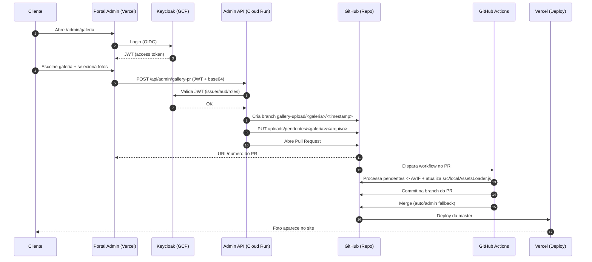

# Arquitetura (Atual)

Este documento descreve como o portal admin publica fotos no site, sem a cliente precisar usar GitHub.

## Visao geral

- Site (Vercel) serve fotos locais versionadas em `public/images/galeria/...`.
- Portal admin (rota `/admin/galeria`) autentica no Keycloak e envia fotos para o backend admin.
- Backend admin (Cloud Run) valida o JWT e abre PR no GitHub com as fotos em `uploads/pendentes/<galeria>/`.
- GitHub Actions processa e otimiza (AVIF), atualiza `src/localAssetsLoader.js` e publica ao entrar na `master`.

## Desenho (Fluxo)

```mermaid
flowchart LR
  U[Cliente (Vitoria)] -->|1. Acessa| A[Portal Admin /admin/galeria (Vercel)]
  A -->|2. Login| K[Keycloak (GCP)]
  A -->|3. POST /api/admin/gallery-pr + JWT| CR[Backend Admin (Cloud Run)]
  CR -->|4. GitHub API: cria branch + sobe pendentes| GH[GitHub Repo]
  GH -->|5. PR aberto/atualizado| GA[GitHub Actions: process-pending-uploads]
  GA -->|6. Converte para AVIF + atualiza mapa| GH
  GH -->|7. Merge na master| V[Vercel Deploy (Site)]
  V -->|8. Serve fotos| S[Site /galeria-*]
```

## Sequencia (Detalhada)



## Componentes e responsabilidades

### 1) Portal Admin (Frontend)

- Onde: rota `https://photo-vitoria.vercel.app/admin/galeria`
- O que faz: coleta arquivos, pede login e chama a Admin API com JWT.
- Codigo: `src/admin/AdminGaleriaUploads.jsx`

### 2) Keycloak (Auth)

- O que faz: login e emissao de JWT.
- Recomendado: usuarios com role `photo-admin`.

### 3) Admin API (Cloud Run)

- Endpoint: `POST /api/admin/gallery-pr`
- O que faz:
  - valida JWT do Keycloak;
  - valida limites e sanitiza nomes;
  - cria branch no GitHub;
  - envia fotos para `uploads/pendentes/<galeria>/`;
  - abre PR e retorna o link.
- Codigo: `server/adminGalleryPrServer.mjs`, `server/adminGalleryPrHandler.mjs`

### 4) Workflow GitHub Actions

- Arquivo: `.github/workflows/process-pending-uploads.yml`
- O que faz:
  - roda `npm run test:uploads`;
  - roda `npm run process:uploads` (Sharp -> AVIF);
  - atualiza `public/images/galeria/<galeria>/` e `src/localAssetsLoader.js`;
  - comita na branch do PR;
  - tenta merge automatico; se auto-merge falhar, usa fallback admin para publicar.
- Script: `scripts/processPendingUploads.mjs`

### 5) Site (Vercel)

- Carrega galerias via `src/localAssetsLoader.js` (local-first).
- Existe fallback opcional para API via `VITE_API_URL` quando `VITE_LOCAL_ASSETS_FIRST=false`.

## Onde as fotos ficam

- Entrada (temporario, no PR): `uploads/pendentes/<galeria>/`
- Saida (publicado no site): `public/images/galeria/<galeria>/`
- Mapa local: `src/localAssetsLoader.js`

## Observacoes importantes

- Se a foto "nao aparece", na maioria dos casos e cache do PWA/navegador. Teste em aba anonima.
- Se o PR foi aberto e os checks passaram, a publicacao depende do merge na `master` e do deploy da Vercel.

