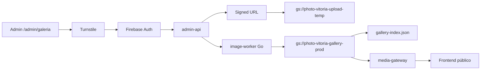
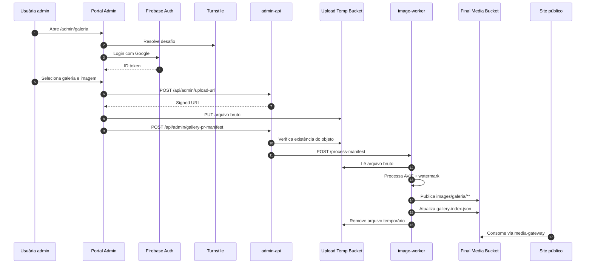

# Arquitetura atual

Este documento descreve a arquitetura real da Photo Vitoria no GCP em maio de 2026.

## Resumo executivo

- frontend público: `React + Vite`
- autenticação administrativa: `Firebase Auth` com login Google
- proteção anti-bot: `Cloudflare Turnstile`
- frontends e APIs: `Cloud Run`
- mídia publicada: `Cloud Storage`
- processamento de imagens: `image-worker` em `Go`
- índice remoto da galeria: `gallery-index.json`
- GitHub: código e deploys, não mais como trilha principal para publicar fotos

## Fluxo de mídia em produção

## Sequência detalhada

## Componentes

### `frontend-gateway`

- runtime: `Cloud Run`
- função:
  - servir o frontend público
  - validar o Turnstile global
- endpoints:
  - `POST /api/turnstile/verify`
  - `GET /healthz`

### `admin-api`

- runtime: `Cloud Run`
- arquivo principal: `server/adminGalleryPrHandler.mjs`
- função:
  - verificar token Firebase
  - aplicar allowlist de e-mails
  - validar Turnstile
  - emitir `Signed URL`
  - disparar o worker
- endpoints:
  - `POST /api/admin/turnstile-verify`
  - `POST /api/admin/upload-url`
  - `POST /api/admin/gallery-pr-manifest`
  - `GET /`

### `image-worker`

- runtime: `Cloud Run`
- linguagem: `Go`
- função:
  - baixar da área temporária
  - converter e otimizar
  - aplicar watermark
  - publicar no bucket final
  - atualizar `gallery-index.json`
- endpoints:
  - `POST /process-manifest`
  - `GET /health`

### `media-gateway`

- runtime: `Cloud Run`
- função:
  - servir imagens publicadas
  - servir `gallery-index.json`
- endpoints:
  - `GET /images/...`
  - `GET /gallery-index.json`
  - `GET /healthz`

## Armazenamento

### Bucket temporário

- nome: `photo-vitoria-upload-temp`
- acesso: privado
- uso:
  - upload bruto vindo do admin

### Bucket final

- nome: `photo-vitoria-gallery-prod`
- conteúdo:
  - `images/galeria/**`
  - `gallery-index.json`

## Segurança

- `Firebase Auth` para identidade
- allowlist de e-mails em `ADMIN_ALLOWED_EMAILS`
- `Turnstile` no site e no admin
- upload via `Signed URL` curta
- verificação de existência do objeto antes de processar
- worker protegido por token interno
- watermark no arquivo final publicado

## Borda e entrega

- domínio principal: `www.estudiovitoriafreitas.com.br`
- frontend servido por `frontend-gateway`
- mídia servida por `media-gateway`
- CDN/LB na frente da entrega pública

## Situação do legado

### Já removido do caminho principal

- Keycloak como autenticação do admin
- VM dedicada para o portal de fotos
- Vercel como runtime principal de produção
- PR por foto como mecanismo obrigatório de publicação

### Ainda existente no código-base, mas fora do caminho principal

- parte do acervo legado em `public/images/galeria/**`
- scripts e dependências históricas que ainda podem ser podados
- documentação antiga em áreas específicas do repositório

## Próximos endurecimentos

- padronizar todos os health checks em `/healthz`
- adicionar `/readyz` para serviços críticos
- ativar `Cloud Armor` quando a quota permitir
- podar dependências legadas que já não fazem parte do runtime
