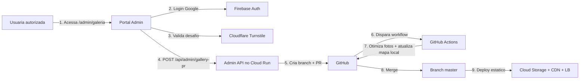
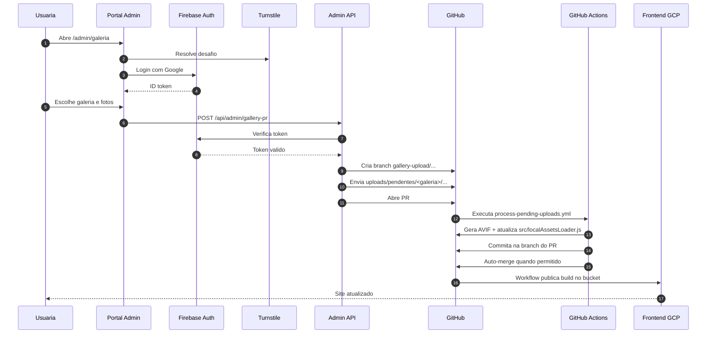

# Arquitetura atual

Este documento descreve a arquitetura real do projeto hoje, com produção e serviços principais no GCP.

## Resumo executivo

- frontend público: `React + Vite`
- produção: `Cloud Storage + Cloud CDN + HTTPS Load Balancer`
- staging: `ambiente opcional fora de produção`
- portal admin: rota `/admin/galeria`
- autenticação do portal: `Firebase Auth` com login Google
- proteção anti-bot: `Cloudflare Turnstile`
- backend do portal: `Cloud Run`
- publicação de imagens: `GitOps` via Pull Request + GitHub Actions

## Fluxo atual de publicação de imagens

## Sequência detalhada

## Componentes

### Frontend público

- código em `src/`
- build estático via `vite build`
- deploy de produção para bucket GCS

### Portal admin

- rota: `/admin/galeria`
- arquivo principal: `src/admin/AdminGaleriaUploads.jsx`
- login Google com Firebase
- Turnstile validado no backend antes do login seguir

### Admin API

- runtime: `Cloud Run`
- arquivo principal: `server/adminGalleryPrHandler.mjs`
- responsabilidades:
  - validar token Firebase
  - aplicar allowlist de e-mails
  - validar payload dos arquivos
  - criar branch e Pull Request no GitHub

### Workflow de processamento

- arquivo: `.github/workflows/process-pending-uploads.yml`
- script: `scripts/processPendingUploads.mjs`
- responsabilidades:
  - validar escopo do PR
  - otimizar imagens
  - atualizar `public/images/galeria/**`
  - atualizar `src/localAssetsLoader.js`
  - concluir merge seguro

## Localização das imagens

### Estado atual

- entrada temporária: `uploads/pendentes/<galeria>/`
- saída publicada: `public/images/galeria/<galeria>/`
- índice local: `src/localAssetsLoader.js`

### Próxima fase planejada

A próxima etapa da arquitetura é retirar os binários do fluxo Git principal e mover o upload para GCS privado.

Desenho alvo:

- bucket privado temporário para upload
- `Signed URLs` emitidas pelo backend
- processamento assíncrono
- promoção do arquivo aprovado para área pública
- frontend servindo imagens já pela borda GCP

## Produção vs staging

### Produção

- branch: `master`
- workflow: `.github/workflows/deploy-frontend-gcp.yml`
- destino: `Cloud Storage + CDN + LB`

### Staging

- branch: `staging`
- workflow: `.github/workflows/deploy-frontend-vercel-staging.yml`
- destino: `ambiente de homologação opcional`

## Pendências reais

- `Cloud Armor` ainda não ativado por quota `SECURITY_POLICIES = 0`
- certificado gerenciado do GCP precisa estar ativo para fechamento total da borda HTTPS
- migração de imagens para `GCS + Signed URLs` ainda não iniciada em produção
